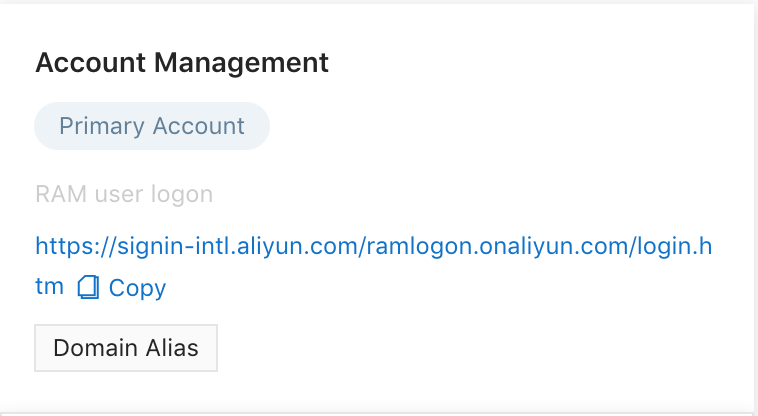
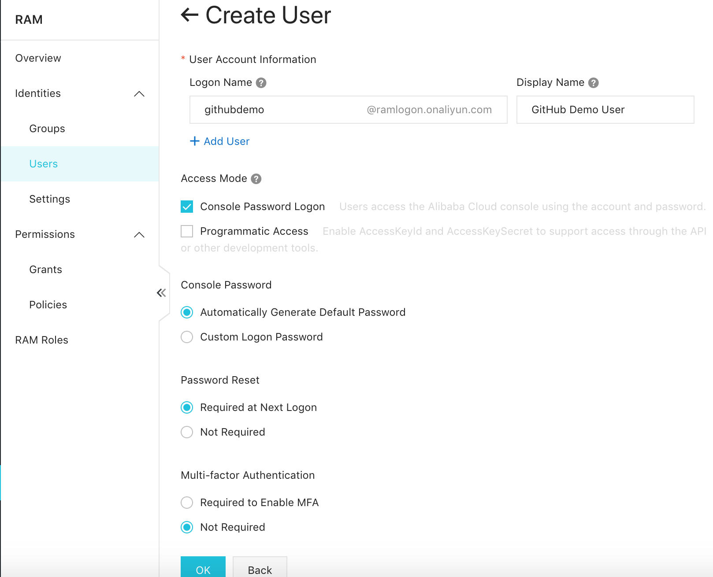
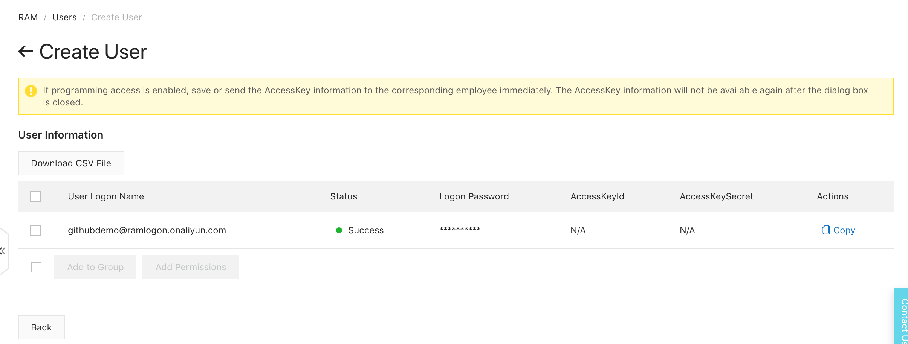
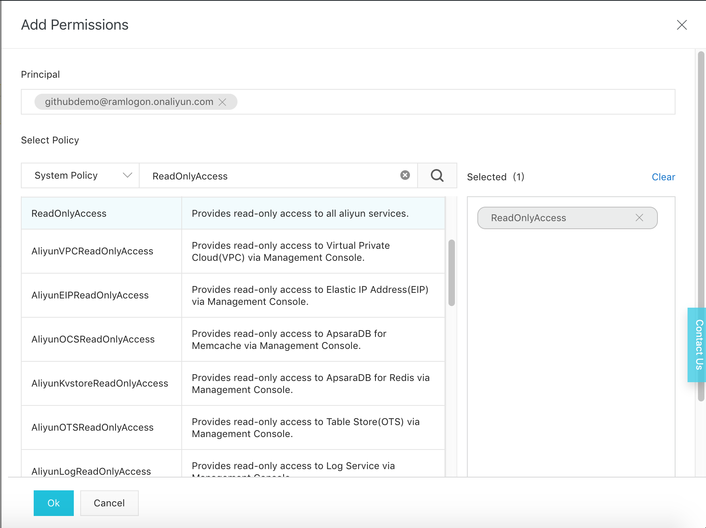

# Alibaba Cloud VPN Gateway Configuration and Troubleshooting

This repository was created to help you with easy Virtual Private Network and Cloud Enterprise Network configuration and troubleshooting.

Table of Contents
=================

   * [Troubleshooting](#troubleshooting)
      * [Hint 1](#hint-1)
      * [Hint 2](#hint-2)
      * [Hint 3](#hint-3)
      * [Hint 4](#hint-4)
      * [Hint 5](#hint-5)

## Troubleshooting

### Hint 1

One of the most important things to consider is the IKE version your local devices support.

It is important because IKEv1 has many limitation in comparison to IKEv2.

The most critical one is the ability to add/insert more than one **local and remote network**. I've seen many customers having the necessity to include more than one local network and it wasn't possible due to the local IDC hardware limitation.

### Hint 2

Before troubleshooting and configuration it is recommended to fill in the https://github.com/wojciehm/Alibaba-Cloud-VPN-Configuration-and-Troubleshooting/blob/master/environment-details.md file.

Once you have the environment details it could be used for configuration and troubleshooting.

### Hint 3

The second step which helps many customers I worked with is to use the draw.io diagram I created and fill it in with all possible data. This step is crucial to confirm that everything is configured.

Link to the file https://github.com/wojciehm/Alibaba-Cloud-VPN-Configuration-and-Troubleshooting/blob/master/files/VPN-Diagram.xml

### Hint 4

Use the environment details as a checkup for any mistakes in local and remote networks.

Many customers make errors in those. Try to understand what is local network from your IDC perspective and Alibaba Cloud VPN Gateway perspective.

### Hint 5

In case you need to troubleshoot the VPN&CEN configuration you can create an additional Resource Access Management (RAM) user with **Read Only Policy**.

1. Login to Alibaba Cloud console.
2. Click on **Home** to see all Alibaba Cloud Services.
3. Under Services, select **Resource Access Management** (RAM).

4. If you never used the RAM service, you will be asked to activate it.
5. Once activated you are now on the Dashboard page.

6. Copy the RAM Login Link.

7. Navigate to **Users**.
8. Click **Create User**.
9. At **Logon Name** and **Display Name** enter **Alibaba_Support_Read-Only** (or any username as you wish), **uncheck** the box **Programmatic Access** and check **Console Password Logon**. 
You can automatically generate password or force user to change the password when logging next time and enable or disable Multi Facto Authentication (MFA).

10. User was created.

11. Select user and click **Add Permissions**.
12. Search for the System Policy with name **ReadOnlyAccess** and click ok.

13. User can now login.
